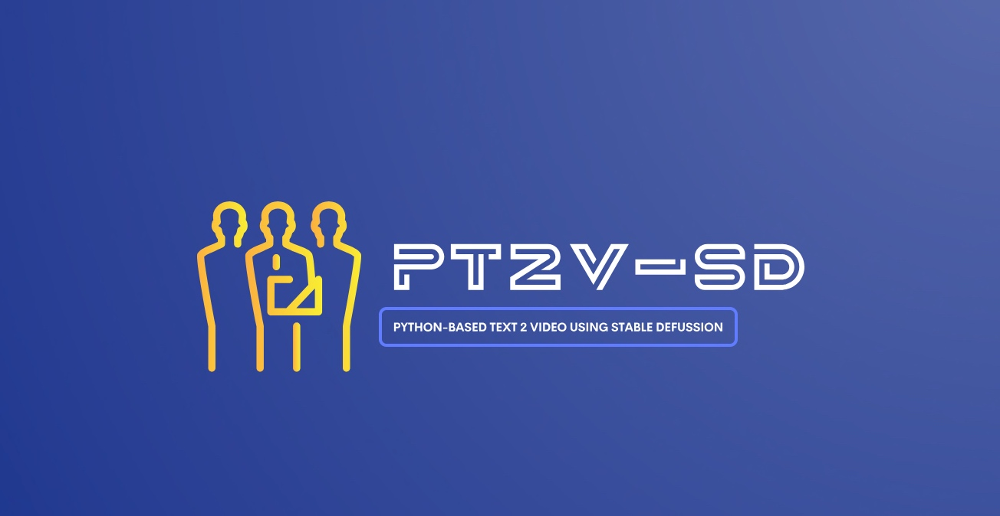

# Building the locally optimized Python-based text to video by Stable Defussion AI & comparing its performance against the same API  (PT2V-SD)



## About this package

This new solution will evaluate the power of Stable Defussion, which is created solutions as we progress & refine our prompt from scratch by using Stable Defussion & Python. This post opens new opportunities for IT companies & business start-ups looking to deliver solutions & have better performance in comparison with the paid version of Stable DSefussion AI's API performance. This project is for the advanced Python, Stable Defussion for data Science Newbies & AI evangelists.


## How to use this package

(The following instructions apply to Posix/bash. Windows users should check [here](https://docs.python.org/3/library/venv.html).)

First, clone this repository and open a terminal inside the root folder.

Install the requirements:

```bash
pip install -r requirements.txt
```

Install the above requirements.

Create and activate a new virtual environment (recommended) for consumer applications by running the following:

```bash
python3.13 -m venv env
source env/bin/activate
```

Run the server, which will interact with Stable Defussion AI API & then run the custom python-based Stable Defussion python-based SDK application.

Built-In AI Application: 

```bash
python generateText2VideoAPI.py
```

Now, the custom solution:

```bash
python generateText2Video.py
```

Please find some of the essential dependent packages -

```
pip install certifi==2024.8.30
pip install diffusers==0.31.0
pip install huggingface-hub==0.26.2
pip install imageio==2.36.0
pip install imageio-ffmpeg==0.5.1
pip install moviepy==2.1.1
pip install numpy==2.1.3
pip install opencv-python==4.10.0.84
pip install pandas==2.2.3
pip install pillow==10.4.0
pip install pip==24.3.1
pip install requests==2.32.3
pip install safetensors==0.4.5
pip install sentencepiece==0.2.0
pip install setuptools==70.2.0
pip install tokenizers==0.20.4rc0
pip install torch==2.6.0.dev20241126
pip install torchaudio==2.5.0.dev20241126
pip install torchvision==0.20.0.dev20241126
pip install tqdm==4.67.1
pip install transformers==4.46.3
pip install websockets==12.0

```

## Screenshots


## Resources

- To view the complete demo with sound, check out our [YouTube Page](https://youtu.be/jMERwsokd6Q).
- To view on Python, check out the [Python Page](https://docs.python.org/3/).
- To view on Stable Defussion, check out the [Stable Defussion Page](https://platform.stability.ai/docs/api-reference#tag/Generate/paths/~1v2beta~1stable-image~1generate~1core/post).
- To view on Hugging Face, check out the [OpenAI Page](https://huggingface.co/stabilityai/stable-diffusion-3.5-large).
